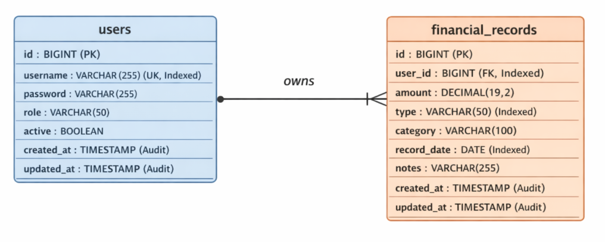

# Finance Control Backend

A robust, production-ready Spring Boot REST API for managing personal finance records with role-based access control.

## Major Technical Features
- **Stack:** Java 17, Spring Boot 4.x, Spring Data JPA, Spring Security.
- **Database:** H2 Database with optimized multi-tenancy (Users 1:N Financial Records).
- **Testing:** Comprehensive coverage using `@WebMvcTest` & Mockito.

## ERD Diagram


## What Makes This App Different? (Unique Features)
- **Jakarta Parameter Validation:** Strong compile-time object schema enforcement via constraints (`@Valid`/`@NotBlank`).
- **Spring Boot Actuator:** Out-of-the-box health checks (`/actuator/health`) for liveness and readiness probes in production environments.
- **RFC 7807 Error Responses:** Standardized, enterprise-grade error JSON formatting.
- **Java Records for DTOs:** Utilizes modern immutable data constructs for efficient payloads.
- **MDC Logging for Trace IDs:** Request tracking injected into logging traces for distributed system observability.
- **Pagination for all `findAll` endpoints:** Scalable data retrieval for list operations.
- **OpenAPI docs with Examples:** Fully interactive API documentation with schemas.
- **JPA Auditing & Auto-Seeding:** Automatic timestamp tracking and seamless demo data generation for instant review.

## How to Run

**Using Docker Compose (Fastest way to test)**
```bash
docker-compose up --build -d
```

## How to Test

**Using OpenAPI (Swagger UI)**
1. Start the application using the Docker commands above.
2. Open your browser and navigate to: [http://localhost:8080/swagger-ui.html](http://localhost:8080/swagger-ui.html)
3. Click the **Authorize** button at the top right of the page.
4. Log in using one of the pre-seeded demo accounts (Basic Auth):
   - **Admin:** `admin` / `admin123`
   - **Analyst:** `analyst` / `analyst123`
   - **Viewer:** `viewer` / `viewer123`
5. Expand any endpoint (e.g., `GET /api/records`), click **"Try it out"**, modify any parameters if desired, and hit **"Execute"** to see live, paginated data with Trace IDs in action!
